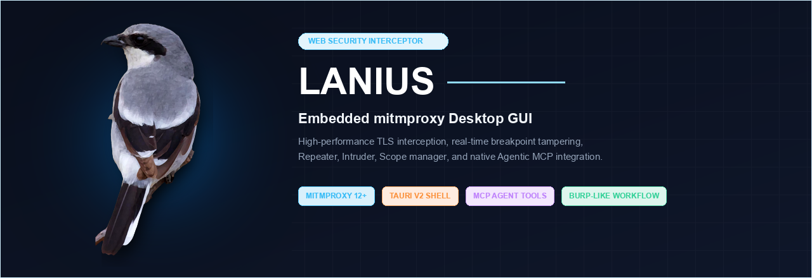

<div align="center">



[](https://github.com/mirusu400/Lanius/actions/workflows/ci.yml)
[](https://github.com/mirusu400/Lanius/actions/workflows/nightly.yml)

**A desktop web security testing proxy, built on mitmproxy.**

[Download](#download) · [Getting started](#getting-started) · [Features](#features) · [Plugins](#plugins) · [AI agents](#ai-agents)

</div>

---

Lanius sits between your browser and the web so you can see every request,
stop it mid flight, change it, and send it again. It is named after the shrike
(genus *Lanius*), a bird that ambushes its prey and pins it to a thorn.

If you have used Burp Suite, you will feel at home. Lanius embeds
[mitmproxy](https://mitmproxy.org/) as its engine, so TLS interception,
HTTP/2 and WebSocket handling are battle tested, and adds a desktop interface
and the workflow tools on top.

## Download

Grab the latest build from the [Releases page](https://github.com/mirusu400/Lanius/releases).
Builds are published nightly whenever something changed, so the newest one
may be a day behind `main`. To run the current code instead, see
[Building from source](#building-from-source).

| Platform | File |
|---|---|
| macOS (Apple Silicon) | `Lanius_*_aarch64.dmg` |
| macOS (Intel) | `Lanius_*_x64.dmg` |
| Linux | `Lanius_*_amd64.AppImage` or `Lanius_*_amd64.deb` |
| Windows | `Lanius_*_x64_en-US.msi` or `Lanius_*_x64-setup.exe` |

Builds are not code signed yet. On macOS, clear the quarantine flag once after
installing:

```bash
xattr -dr com.apple.quarantine /Applications/Lanius.app
```

On Windows, SmartScreen will warn about an unrecognised publisher. Choose
**More info** then **Run anyway**.

## Getting started

**1. Open Lanius.** The proxy starts automatically on `127.0.0.1:8080`.

**2. Point your browser at the proxy.** Set the HTTP and HTTPS proxy to
`127.0.0.1` port `8080` in your system or browser network settings.

**3. Install the CA certificate.** This is what lets Lanius read HTTPS. Open
the **Settings** tab and download the certificate, or visit
<http://mitm.it> from the device you configured and follow the instructions
for your platform. You only do this once.

**4. Browse.** Requests appear live in the **Proxy** tab.

To check it is working without touching your browser settings:

```bash
curl -x http://127.0.0.1:8080 http://example.com/
```

### In-app documentation

The **Docs** tab explains the features that need more than a tooltip, in the
interface language you have selected.

### Capturing apps that ignore proxy settings

Some applications never look at the system proxy. Lanius can capture them at
the operating system level instead, so they do not need to be configured at
all. This is experimental.

Open the **Settings** tab, find **System capture**, and choose whether to
capture every application or only the ones you name. Selected applications
gives you a list: add a rule and type part of a name, or pick from what is
running and have its path filled in.

Each rule matches part of the executable path, so a fragment is enough:

```
chrome            Google Chrome, and anything with chrome in its path
/Applications/    everything installed there
pid:4123          one process
```

Set a rule to exclude to leave something out, or untick it to switch it off
without deleting it.

On macOS this installs a network extension the first time, and macOS will ask
you to approve it in **System Settings > General > Login Items & Extensions >
Network Extensions**. Lanius tells you when it is waiting. On Windows the
helper needs to run with administrator rights.

The system redirector cannot be reconfigured while it is running, so changing
the setting after capture has already started takes effect on the next launch.
Lanius says so when that happens.

Applications that pin their certificates will refuse the connection rather
than be intercepted. That is a property of pinning, not something Lanius can
work around.

### Looking like a browser

Lanius terminates TLS, so the server fingerprints the proxy rather than your
client. **Settings > TLS fingerprint** reshapes the handshake to resemble
Chrome, Firefox or Safari, or forces TLS 1.2, and accepts a custom OpenSSL
cipher string. This covers the cipher list and TLS version, not a full JA3 or
JA4 match.

### Where the proxy listens

Port 8080 is a popular default and another tool may already have it. Open
**Settings > Proxy listener** and pick a free port. If the port was taken at
launch, Lanius says so there and keeps running so you can change it; the rest
of the app works meanwhile.

The same section sets the bind address. By default the proxy accepts
connections from this machine only. Choose **All interfaces** or a specific
address to let a phone or a virtual machine point at it, then set their proxy
to this machine's address and the port shown. Anyone who can reach that
address can send traffic through your proxy, so prefer a specific address over
all interfaces on a network you do not control.

The API port can also be moved, though only before launching:

```bash
LANIUS_API_PORT=8091 open -a Lanius
```

### Projects

Captured traffic, your scope and the tabs you have open are saved as you
work, so closing Lanius and opening it again puts you back where you were.
**Settings > Project** exports the lot as one JSON file, with a second button
that leaves the capture out when you only want to pass on a scope and a set
of requests.

## Features

### Proxy

Every request and response, live. Filter by host, method, status or free text,
pause the stream while you read, and inspect headers and bodies. Sensitive
headers such as `Authorization` and `Cookie` are masked by default; reveal them
with one click when you need to.

Right-click a request to send it to Repeater or Intruder, add it to the scope,
or copy it as a URL or a curl command. The site map, Repeater tabs and Intruder
results have their own menus.

### Intercept

Hold a request before it reaches the server, edit it as raw HTTP, then forward
or drop it. You can intercept responses too, and limit interception to a single
host so the rest of your browsing is unaffected.

### Target

A site map of everything you have visited, grouped by host and path. Lanius
also collapses dynamic paths into endpoints, so `/users/1`, `/users/2` and
`/users/3` become a single `/users/{id}` entry with the parameters it saw.

Define a **scope** with include and exclude rules to keep your attention on the
application under test. Scope rules persist across restarts, and you can tell
Lanius to stop recording out of scope traffic entirely.

### Repeater

Send a request again, as many times as you like, tweaking it between attempts.
Open several tabs to compare different variations side by side.

### Intruder

Mark payload positions and run a wordlist against them. All four classic attack
types are supported:

| Type | Behaviour |
|---|---|
| Sniper | One position at a time |
| Battering ram | The same value in every position |
| Pitchfork | Payload sets advance together |
| Cluster bomb | Every combination |

Results show status, length and timing, and responses whose length stands out
from the rest are highlighted automatically, so a successful login in a pile of
failures is hard to miss.

### Decoder and Comparer

Chain encoders and decoders: URL, Base64, hex, HTML, gzip, JWT and common
hashes. Every step shows its own output, so you can see where a chain goes
wrong, and the result pane shows the final value as text or as a hex dump.

The Decoder keeps several payloads open at once, each with its own chain, so
you can work through a handful of tokens without losing the one before.

Compare two requests or responses word by word or byte by byte.

### Raw TCP

Traffic that is not HTTP is relayed at the byte level and shown as a hex dump,
so you can still see what is on the wire.

### Language

The interface is available in English and Korean. Switch in **Settings**; the
choice is remembered.

## Plugins

Plugins are ordinary mitmproxy addons. Drop a Python file into
`~/.lanius/plugins`, then enable it from the **Plugins** tab. It applies to
live traffic immediately, and you can reload it after an edit without
restarting.

```python
DESCRIPTION = "Tag responses that are missing a CSP header"

class Plugin:
    def response(self, flow):
        if "content-security-policy" not in flow.response.headers:
            flow.comment = "no CSP"
```

Two working examples ship in [`plugins/`](./plugins/), and the full hook list
is in [`plugins/README.md`](./plugins/README.md).

Plugins run inside the engine process, not a sandbox. Only enable code you
trust.

## AI agents

Lanius speaks [MCP](https://modelcontextprotocol.io/), so a coding agent can
browse your captured traffic, manage scope, hold and edit intercepted
requests, and replay them.

```jsonc
{
  "mcpServers": {
    "lanius": {
      "command": "/path/to/Lanius/engine/.venv/bin/python",
      "args": ["-m", "app.mcp"],
      "cwd": "/path/to/Lanius/engine"
    }
  }
}
```

While the app is running you can also connect over HTTP, which additionally
exposes the interception and replay tools. **Settings > AI agents** shows the
endpoint, lists every tool with whether it only reads or actually acts, and
has a configuration you can copy straight into your client.

Secrets are redacted in every response unless the agent explicitly asks for
them, so tokens do not leak into a transcript by accident.

An agent with these tools can send traffic through your proxy, change your
scope and release held requests. Untick **Allow agents to connect** and
connections are refused. The endpoint listens on this machine only, even when
the proxy itself is bound to the network.

## Building from source

You need Python 3.13 or newer, Node 22 and a Rust toolchain. Builds run on macOS,
Linux and Windows.

```bash
# Engine
cd engine
python3.13 -m venv .venv && . .venv/bin/activate
pip install -r requirements-dev.txt

# Desktop app
.venv/bin/pyinstaller --clean --noconfirm lanius-engine.spec
cd ../shell && npm ci && npx tauri build
```

To run the pieces separately while developing:

```bash
cd engine && python -m app.main    # proxy on :8080, API on :8081
cd ui && npm run dev               # interface on :5173
```

## Legal

Lanius is a tool for testing systems you are authorised to test. Confirming you
have permission is your responsibility.

<div align="center">
<br>

</div>
