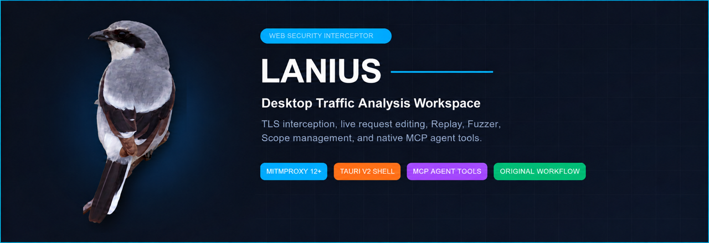

<div align="center">



[](https://github.com/mirusu400/Lanius/actions/workflows/ci.yml)
[](https://github.com/mirusu400/Lanius/actions/workflows/nightly.yml)

**A desktop web security testing proxy, built on mitmproxy.**

[Download](#download) · [Getting started](#getting-started) · [Features](#features) · [Plugins](#plugins) · [AI agents](#ai-agents)

</div>

---

Lanius sits between your browser and the web so you can see every request,
stop it mid flight, change it, and send it again. It is named after the shrike
(genus *Lanius*), a bird that ambushes its prey and pins it to a thorn.

Lanius embeds [mitmproxy](https://mitmproxy.org/) as its engine, so TLS
interception, HTTP/2 and WebSocket handling are battle tested. Its desktop
interface adds project-based capture, live editing, request replay, payload
fuzzing, encoding and decoding, diffs, plugins, and native MCP tools.

## Download

Grab the latest build from the
[Nightly release](https://github.com/mirusu400/Lanius/releases/tag/nightly).
It is rebuilt from every commit that lands on `main` and passes CI, so the
download always matches the current code. Settings, About says which commit
a build came from, and checks whether a newer one has been published: a
nightly is compared by commit and a tagged release by version, since every
nightly this month reports the same version number. The desktop app can
install what it finds, in one press; nothing downloads on its own, and the
check itself can be turned off for a network where nothing should leave
the machine.

For sensitive networks, **Settings > Lockdown Mode** has separate global and
project switches. They block Lanius-owned external requests while browser and
proxy traffic remain available by default. A project option can additionally
drop out-of-scope HTTP/HTTPS proxy traffic and all raw TCP/UDP while Lockdown is
active. The global switch can also be forced before launch with
`LANIUS_LOCKDOWN=1`. See [Lockdown Mode](docs/lockdown-mode.md) for the exact
scope.

| Platform | File |
|---|---|
| macOS (Apple Silicon) | `Lanius_*_aarch64.dmg` |
| macOS (Intel) | `Lanius_*_x64.dmg` |
| Linux | `Lanius_*_amd64.AppImage` or `Lanius_*_amd64.deb` |
| Windows | `Lanius_*_x64_en-US.msi` or `Lanius_*_x64-setup.exe` |

Builds are not code signed yet. On macOS, clear the quarantine flag once after
installing:

```bash
xattr -dr com.apple.quarantine /Applications/Lanius.app
```

On Windows, SmartScreen will warn about an unrecognised publisher. Choose
**More info** then **Run anyway**.

## Getting started

**1. Open Lanius and choose a project.** Start a temporary project for one
session, create a named project, or reopen an existing one. The proxy then
starts on `127.0.0.1:8080`.

**2. Click Open browser.** It is next to the history in the **Proxy** tab.
A Chromium browser starts already pointed at the proxy and already trusting
the CA, in a profile of its own, so your usual browser is untouched. Requests
appear live as you browse.

Needs Chrome, Chromium, Edge or Brave. To use your own browser instead:

**2a. Point your browser at the proxy.** Set the HTTP and HTTPS proxy to
`127.0.0.1` port `8080` in your system or browser network settings.

**2b. Install the CA certificate.** This is what lets Lanius read HTTPS. Open
the **Settings** tab and download the certificate, or visit
<http://mitm.it> from the device you configured and follow the instructions
for your platform. You only do this once.

To check it is working without touching your browser settings:

```bash
curl -x http://127.0.0.1:8080 http://example.com/
```

### In-app documentation

The **Docs** tab explains the features that need more than a tooltip, in the
interface language you have selected.
Settings and Docs use the available window width when you resize the app.

### Capturing apps that ignore proxy settings

Some applications never look at the system proxy. Lanius can capture them at
the operating system level instead, so they do not need to be configured at
all. This is experimental.

Open the **Settings** tab, find **System capture**, and choose whether to
capture every application or only the ones you name. Selected applications
gives you a list: add a rule and type part of a name, or pick from what is
running and have its path filled in.

Each rule matches part of the executable path, so a fragment is enough:

```
chrome            Google Chrome, and anything with chrome in its path
/Applications/    everything installed there
pid:4123          one process
```

Set a rule to exclude to leave something out, or untick it to switch it off
without deleting it.

On macOS this installs a network extension the first time, and macOS will ask
you to approve it in **System Settings > General > Login Items & Extensions >
Network Extensions**. Lanius tells you when it is waiting. On Windows the
helper needs to run with administrator rights.

The system redirector cannot be reconfigured while it is running, so changing
the setting after capture has already started takes effect on the next launch.
Lanius says so when that happens.

Applications that pin their certificates will refuse the connection rather
than be intercepted. That is a property of pinning, not something Lanius can
work around.

### Looking like a browser

Lanius terminates TLS, so the server fingerprints the proxy rather than your
client. **Settings > TLS fingerprint** reshapes the handshake to resemble
Chrome, Firefox or Safari, or forces TLS 1.2, and accepts a custom OpenSSL
cipher string. This covers the cipher list and TLS version, not a full JA3 or
JA4 match.

On macOS, HTTPS server certificates are verified automatically using Keychain
trust settings, including trusted VPN and private CAs. A CA already trusted
for SSL in Keychain does not need to be registered again in Lanius. Installing
a certificate alone does not make it trusted. Hostname and leaf validity checks
remain enabled, and verification does not download intermediates or revocation
responses. New connections use the current Keychain trust settings.

**Settings > Proxy > Upstream CA certificates** lets a project add other VPN or
private CAs when needed. Choose a PEM file or paste its public CA certificates,
then apply. These supplement macOS trust; other platforms extend the default
public CA list. Server certificate verification stays enabled.
Applying or removing it restarts proxy connections and cancels active
Replay/Fuzzer requests. CA certificates are saved in the project database,
but importing a project keeps the current CA trust: new trust anchors must be
registered explicitly. Private keys, leaf certificates and expired CAs are
rejected.

### Where the proxy listens

Port 8080 is a popular default and another tool may already have it. Open
**Settings > Proxy listener** and pick a free port. If the port was taken at
launch, Lanius says so there and keeps running so you can change it; the rest
of the app works meanwhile.

The same section sets the bind address. By default the proxy accepts
connections from this machine only. Choose **All interfaces** or a specific
address to let a phone or a virtual machine point at it, then set their proxy
to this machine's address and the port shown. Anyone who can reach that
address can send traffic through your proxy, so prefer a specific address over
all interfaces on a network you do not control.

The API and MCP share a local port (default `12954`). Change it in **Settings >
AI agents**; Lanius restarts the active project's engine on the new port. The
project picker also lets you change it before opening a project if the current
port is busy. A launch-time override is also available:

```bash
LANIUS_API_PORT=8091 open -a Lanius
```

### Upstream proxy

To send browser traffic through other proxies, open **Settings > Proxy >
Upstream proxy**, choose **Use upstream proxy**, and enter HTTP, HTTPS, or
SOCKS5 proxy URLs such as `http://127.0.0.1:8081` and
`socks5://127.0.0.1:1080`. Add and reorder hops to choose the path from
Lanius to the destination. The browser still connects to Lanius. The chain
is saved with the project and takes effect when applied. HTTPS proxy
certificates are verified. Proxy authentication is not supported yet.
SOCKS5 routing covers TCP connections; UDP relay is not part of the browser
listener.

Multi-hop and SOCKS5 routing use a bundled [GOST](https://github.com/go-gost/gost)
v3.3.0 bridge on a loopback port. Run `python3 scripts/fetch_gost.py` before
freezing the engine locally; release builds fetch the pinned, hash-checked
binary automatically. GOST is licensed under MIT.

### Appearance

**Settings > Appearance** offers Steel as the default dark palette, the
original dark palette as Classic Dark, Light, Copper, Sage, Paper, and six
editor palette adaptations: Monokai Classic, Gruvbox Dark, Dracula, Tokyo
Night, Catppuccin Mocha, and Solarized Dark. Their sources are credited in
[theme sources](docs/theme-sources.md).
It follows the system by default. The interface
font and the editor font are set separately, with
their own sizes, since one is for labels and the other for raw HTTP where a
monospace font keeps columns lined up. A preview shows the result as you
change it.

These belong to the machine rather than the project, so they are not part of
an export.

### Keyboard shortcuts

Switch between Lanius screens with **⌘+Option+0–9** on macOS or
**Ctrl+Alt+0–9** on Linux and Windows (Dashboard is 0, Proxy is 1, and the
remaining screens follow the tab bar). Use **⌘+Option+D** or **Ctrl+Alt+D**
for Docs. **Settings > Shortcuts** lists every screen and Replay action, and
lets you record, disable, or reset each shortcut. These choices are saved on
this machine.

### Projects

At launch, choose a temporary project or a named project. Each named project
has its own database and data directory under `~/.lanius/projects/`, so
captured traffic, scope, proxy settings and open tabs stay separate. The
previous single-database workspace remains available as **Previous work**.
Temporary projects are removed when closed. Use **Settings > Project > Switch**
to return to the chooser.

Work is saved as you go. **Settings > Project > Back up complete database**
downloads a consistent SQLite snapshot with every HTTP body and WebSocket
message. The JSON export is intended for sharing smaller projects: it holds
at most 100,000 HTTP flows, omits WebSocket messages, and its readable body
encoding cannot preserve arbitrary binary bytes. Projects above that limit
receive an error instead of a silently shortened JSON export. A second JSON
button leaves the capture out when you only want to pass on a scope and a set
of requests. The same screen shows
which captured targets use space. Select targets to remove their requests and
compact the database, or compact only to reclaim pages freed earlier. The
preview shows request counts and the confirmation names what will be deleted.
Existing projects build summary and full text indexes once when first opened
after upgrading; a large project can take minutes on that first launch and
requires additional disk space.

## Features

### Proxy

Every request and response, live. Filter by host, method, status or free text,
pause the stream while you read, and inspect headers and bodies. Sensitive
headers such as `Authorization` and `Cookie` are masked by default; reveal them
with one click when you need to.

Bodies carrying `Content-Encoding: gzip`, `deflate`, `br`, or `zstd` are
decompressed for display by default in History, Intercept, Replay and
Fuzzer. The original bytes stay in the capture and edited requests are
encoded again before sending. This can be disabled under **Settings > Proxy >
HTTP body display**. `Accept-Encoding` only advertises acceptable response
formats and does not mean that the request body itself is compressed.
Captured request and response bodies are stored without the former 5 MiB
database limit. The original bytes are available from
`GET /api/flows/{id}/body/request` and `/response`.
Bytes already cut off by older versions cannot be recovered by upgrading.

History has a **Modified** column. When Match & Replace, Intercept, or a plugin
changes a request, its detail pane keeps **Original**, **Auto-modified**, and
**Modified request** tabs so every stage can be compared.
History shows 200 requests per page; **Older**, **Newer**, and the page number
field move through the whole project. Search checks host, path, query,
headers, decoded request and response bodies, comments, and request versions
throughout the capture. The trigram index accelerates searches containing at
least three consecutive characters; shorter searches can still scan the
index. Pages use a snapshot anchor so new captures do not shift older pages.
Sequential **Older** navigation uses a cursor, so deleting an earlier row does
not skip surviving records. A direct page-number jump still uses an offset,
which can move after deletions. The scope filter applies before paging, so a
rare old in-scope request remains reachable. API and MCP clients can pass the
returned `anchor` and `next_cursor` on later flow pages.
Drag a table column header's right edge to resize it in History and other
headed data tables. Column widths are remembered on this machine.
Drag the divider between side-by-side panes to resize them in Proxy,
WebSockets, Replay, Fuzzer, Logger, Diff, Docs, and editor dialogs.
Each pane position is remembered independently.

Right-click a request to send it to Replay or Fuzzer, add it to the scope,
or copy it as a URL. The site map, Replay tabs and Fuzzer results have
their own menus.

### Taking a request elsewhere

**Copy as** turns the request you are looking at into something you can run
somewhere else: curl, `fetch`, or Python `requests`. It is built from the
request the proxy actually saw, headers and body included, so the code repeats
it rather than approximating it. Available in Replay and Fuzzer too, where
it reflects your edits.

**CSRF proof of concept** builds a page that makes a browser send the request
by itself. Lanius opens it through the proxy, so the forged request appears in
the history next to the real one. When a request cannot be forged from another
site, because it needs a custom header or a JSON body or a method a form cannot
send, Lanius says so instead of producing a page that sends something else.

The example plugin `copy_as_python_redacted` adds **Python requests
(redacted)**, which replaces cookies, tokens and passwords with `[redacted]`
so a request can go into a report without the credentials going with it.

### Intercept

Hold a request before it reaches the server, edit it as raw HTTP, then forward
or drop it. You can intercept responses too, and limit interception to a single
host so the rest of your browsing is unaffected.

**Match & Replace** opens from this screen and from **Settings > Proxy**. Rules
can rewrite request URLs, headers and bodies, an entire raw request, or an
entire raw response. Paste a sample HTTP message into **Replace Preview** to
see the enabled rules' result before saving them.
Plain text and regular expressions are supported, rules can be toggled without
deleting them, and the saved rules travel with a project export. Body rules run
against decompressed content while preserving the message's wire encoding.

### WebSockets

The **WebSockets** view under Proxy records text and binary messages in both
directions. Turn interception on for client messages, server messages, or both,
then edit and forward or drop held messages. A captured message can also be
edited and sent again to either side of its still-active connection. Binary
messages are shown and edited as Base64 so their bytes are not corrupted.
WebSocket message history is stored as raw bytes in the project database.
The view loads 200 at a time and can page through all earlier messages after a
restart. `GET /api/websockets/messages/{id}/raw` returns the exact frame bytes.
Frames discarded by older versions before this upgrade are not recoverable.

### Target

A site map of everything you have visited, grouped by host and path. Lanius
also collapses dynamic paths into endpoints, so `/users/1`, `/users/2` and
`/users/3` become a single `/users/{id}` entry with the parameters it saw.
The map first loads site summaries. Opening a site or folder loads up to 200
requests; **Load more requests** fetches the next page. This keeps a long
capture from loading every request into the interface at once. Folder names
are discovered separately, so a folder whose requests are on a later page is
visible immediately. **Load more folders** pages unusually large directories.
**In scope only** applies to the requests and folders inside each site as well
as to the site list.
**Expand all**
is available for smaller projects; open sites individually in a large one.
In the site map, Ctrl/⌘-click to select separate sites, folders or requests,
or Shift-click to select a visible range. Right-click a selected row to delete
the selection together after reviewing the confirmation. When a folder has not
been fully loaded, the confirmation does not show an incomplete request count.
Drag the divider between the site tree and request detail to resize either
pane. Endpoint and Scope table columns can also be resized from their header
edges. These sizes are remembered on this machine.
Click an endpoint to browse every captured request in that group, inspect its
request and response, or right-click it to send it to Replay or Fuzzer.
Endpoint counts, status codes and query parameter names cover the full saved
history. Requests within an endpoint load in pages. The displayed path values
and example URLs are samples of captured requests.
The request and response panes have a draggable divider; raw text wraps long
lines and its editor height can be adjusted.

Define a **scope** with include and exclude rules to keep your attention on the
application under test. Scope rules persist across restarts, and you can tell
Lanius to stop recording out of scope traffic entirely. In Lockdown settings,
the separate scope egress option can prevent that traffic from being sent at
all while Lockdown is active.
The Scope field accepts full URLs or scheme-free host patterns. A plain domain
matches any host containing that text, on both HTTP and HTTPS. In the default
mode, `*` matches any number of characters and `?` matches one character.
Enable **Regex** to match host names with a regular expression instead; use
`.*` for any number of characters and `?` to make the preceding item optional.
When a scheme is omitted, all ports match unless a port is specified.

### Replay

Send a request again, as many times as you like, tweaking it between attempts.
Open several tabs to compare different variations side by side. Send the active
request with **⌘+Enter** on macOS or **Ctrl+Enter** on Linux and Windows. Change,
disable, or restore shortcuts under **Settings > Shortcuts**. Replay also has
shortcuts for creating, duplicating, closing, and moving between request tabs.

### Fuzzer

Mark payload positions and run a wordlist against them. Four run modes are
supported:

| Type | Behaviour |
|---|---|
| Single position | One position at a time |
| Shared payload | The same value in every position |
| Lockstep | Payload sets advance together |
| Cartesian product | Every combination |

Results show status, length and timing, and responses whose length stands out
from the rest are highlighted automatically, so a successful login in a pile of
failures is hard to miss.

### Decoder and Diff

Chain encoders and decoders: URL, Base64, hex, HTML, gzip, JWT and common
hashes. Every step shows its own output, so you can see where a chain goes
wrong, and the result pane shows the final value as text or as a hex dump.

The Decoder keeps several payloads open at once, each with its own chain, so
you can work through a handful of tokens without losing the one before.

Compare two requests or responses word by word or byte by byte.

### Raw TCP

Traffic that is not HTTP is relayed at the byte level and shown as a hex dump,
so you can still see what is on the wire.

### Language

The interface is available in English and Korean. Switch in **Settings**; the
choice is remembered.

## Plugins

Plugins are ordinary mitmproxy addons. Drop a Python file into
`~/.lanius/plugins`, then enable it from the **Plugins** tab. It applies to
live traffic immediately. The management screen separates installed plugins
from catalogue releases and gives each installed plugin its own overview,
settings, live logs, performance diagnostics, and packaged views. Plugins can
be reordered, reloaded manually, or watched and reloaded automatically after
an edit without restarting. Set `LANIUS_DISABLE_PLUGINS=1` before launch to
inspect a project in plugin safe mode.

```python
DESCRIPTION = "Tag responses that are missing a CSP header"

class Plugin:
    def response(self, flow):
        if "content-security-policy" not in flow.response.headers:
            flow.comment = "no CSP"
```

A plugin can also add an entry to the right-click menus without shipping any
UI, by declaring a code format:

```python
from app.codegen import RequestSpec, as_python_requests, redacted

class Plugin:
    codegen_formats = {
        "python-redacted": ("Python requests (redacted)",
                            lambda spec: as_python_requests(redacted(spec))),
    }
```

Loose-file development examples ship in [`plugins/`](./plugins/), and the full
hook list is in [`plugins/README.md`](./plugins/README.md). The empty Plugins
screen can also install the bundled **Request Marker** package. It starts
disabled, adds a configurable `X-Lanius-Sample` request header when enabled,
and demonstrates SDK actions, settings, logging, traffic hooks, and a sandboxed
view. Actions, codecs,
settings, namespaced storage, payload extensions, and managed tasks use the
versioned [`lanius_sdk`](./docs/plugins-sdk.md). Declared actions appear in the
matching History, Target, message, Replay, Fuzzer, or global UI location;
package data is available through a bounded read-only resource API.
Each plugin has a session-only 500-entry log buffer that combines SDK logging,
Python logging, stdout/stderr, and host-captured lifecycle or hook failures.
Logs are viewed, filtered, copied, paused, or cleared separately from
performance diagnostics; they are not written into projects or exports.
Scanner checks that fail five times consecutively are suspended until
diagnostics are reset.
Installable `.lanius-plugin` archives, signatures, and sandboxed UI are
documented in [`docs/plugin-packages.md`](./docs/plugin-packages.md).
The Plugins tab can browse user-configured signed catalogues, install compatible
releases, update them with a retained backup, roll back, and reject revoked
versions. The catalogue format is in
[`docs/plugin-catalogues.md`](./docs/plugin-catalogues.md).
Plugin supplied passive and active checks create deduplicated project findings
in the **Issues** tab; limits and SDK contracts are documented in
[`docs/plugin-scanner.md`](./docs/plugin-scanner.md).
The complete implementation inventory, trust boundary, phase coverage, and
recommended next extensions are in
[`docs/plugin-platform-status.md`](./docs/plugin-platform-status.md).

Plugins run inside the engine process, not a sandbox. Only enable code you
trust.

## AI agents

Lanius speaks [MCP](https://modelcontextprotocol.io/), so a coding agent can
browse your captured traffic, manage scope, hold and edit intercepted
requests, and replay them.

```jsonc
{
  "mcpServers": {
    "lanius": {
      "command": "/path/to/Lanius/engine/.venv/bin/python",
      "args": ["-m", "app.mcp"],
      "cwd": "/path/to/Lanius/engine"
    }
  }
}
```

While the app is running you can also connect over HTTP, which additionally
exposes the interception and replay tools. **Settings > AI agents** shows the
endpoint, lists every tool with whether it only reads or actually acts, and
has a configuration you can copy straight into your client.

Secrets are redacted in every response unless the agent explicitly asks for
them, so tokens do not leak into a transcript by accident.

An agent with these tools can send traffic through your proxy, change your
scope and release held requests. Untick **Allow agents to connect** and
connections are refused. The endpoint listens on this machine only, even when
the proxy itself is bound to the network.

## Building from source

You need Python 3.13 or newer, Node 22 and a Rust toolchain. Builds run on macOS,
Linux and Windows.

```bash
# Engine
cd engine
python3.13 -m venv .venv && . .venv/bin/activate
pip install -r requirements-dev.txt

# Desktop app
.venv/bin/pyinstaller --clean --noconfirm lanius-engine.spec
cd ../shell && npm ci && npx tauri build
```

To run the pieces separately while developing:

```bash
cd engine && python -m app.main    # proxy on :8080, API/MCP on :12954
cd ui && npm run dev               # interface on :5173
```

### Releasing with the in-app updater

Nightlies can install themselves: Settings, About offers **Install and
restart**, which downloads the new bundle, verifies its signature, replaces
the app (engine included) and comes back up. It is off until the repository
has a signing key, and until then the app only links to the download.

One-time setup:

```bash
cd shell && npx tauri signer generate -w ~/.tauri/lanius.key
gh secret set TAURI_SIGNING_PRIVATE_KEY < ~/.tauri/lanius.key
gh secret set TAURI_SIGNING_PRIVATE_KEY_PASSWORD   # the password you chose
```

Then paste the public half into `pubkey` in
`shell/src-tauri/tauri.updater.conf.json` and commit it. The private key
never leaves your machine and the secrets; anyone holding it can publish a
build that every installation will accept, so treat it as the release key it
is. Nightly builds then carry a version of the form
`0.1.0-nightly.20260928T1009`, because an updater compares versions and every
build calling itself 0.1.0 is not comparable, and the release grows a
`latest.json` the app reads.

Debian packages cannot replace themselves, so `.deb` installs keep using the
download link. macOS builds are still unsigned by Apple, so the first launch
after an update can show the usual unidentified-developer warning.

Everything CI checks also runs locally, in well under a minute:

```bash
scripts/check.sh          # engine, ui and shell, as CI would
scripts/check.sh quick    # the fast subset, for a tight loop
scripts/check.sh engine   # one part only
```

To repeat the disposable database benchmark after installing engine dependencies:

```bash
engine/.venv/bin/python scripts/benchmark_large_project.py --rows 2000000
```

It creates a temporary project database, measures its upgrade and common
queries, then removes it. It does not measure proxy network throughput or UI
frame rate.

## Legal

Lanius is a tool for testing systems you are authorised to test. Confirming you
have permission is your responsibility.

<div align="center">
<br>

</div>
