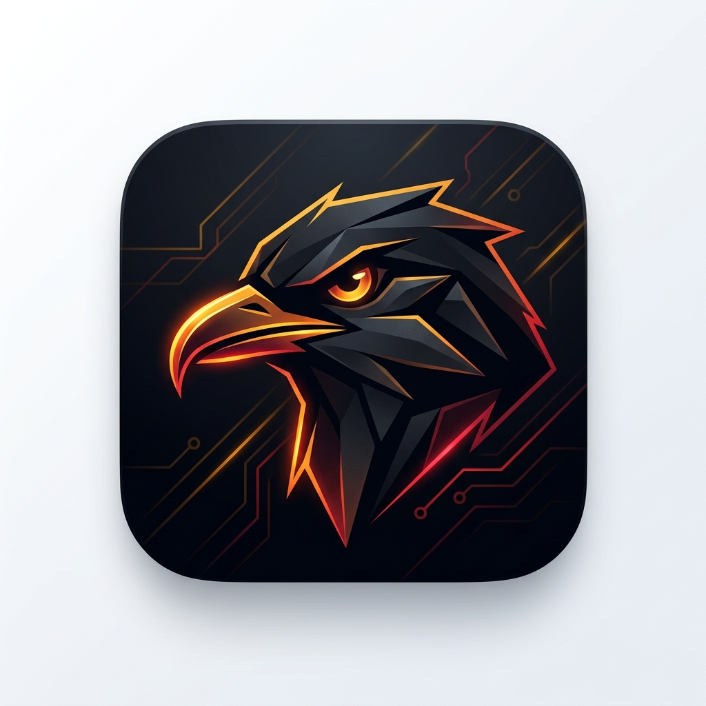
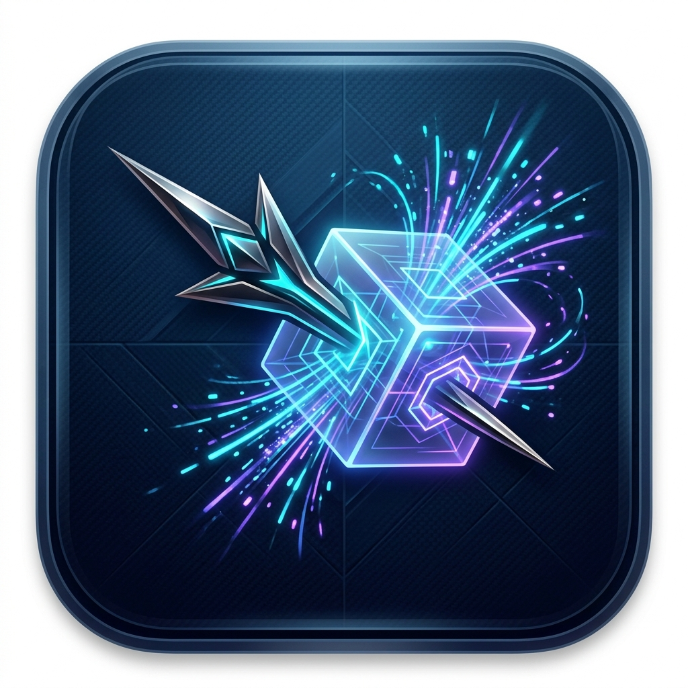
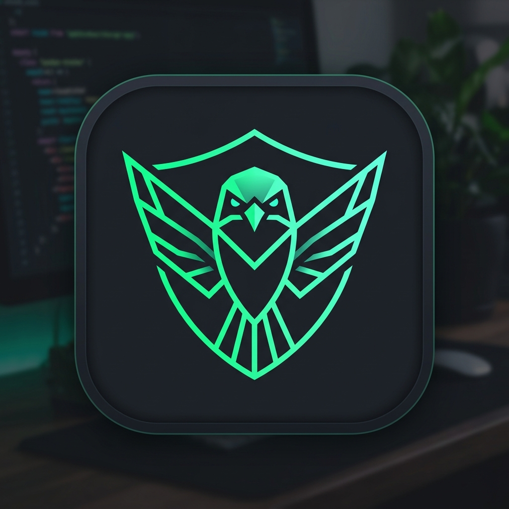
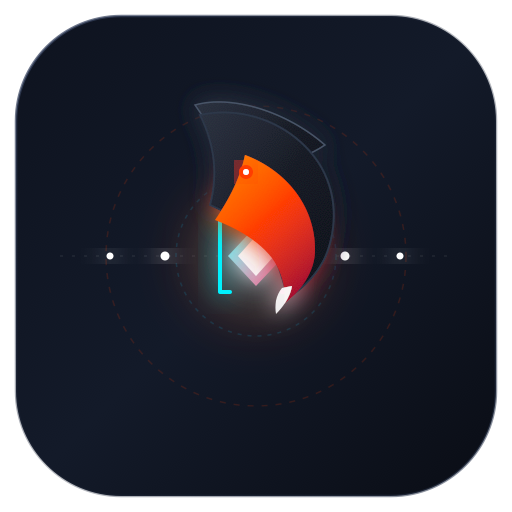
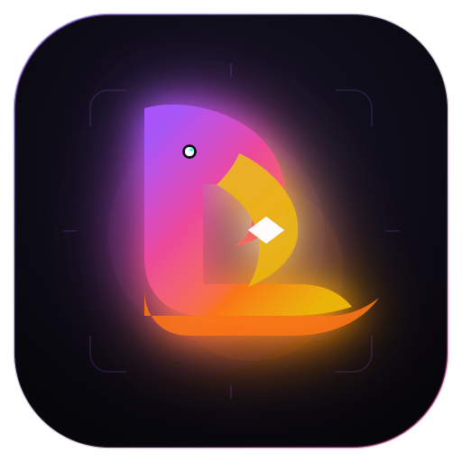

# Lanius (라니우스) 앱 아이콘 디자인 견본 5선

[CODEX.MD](file:///Users/seongjinkim/lab/Lanius/CODEX.MD)에 명시된 **Lanius(때까치 속명, Butcher Bird)**의 상징성과 **웹 보안 프록시(Mitmproxy 임베드, 인터셉트/브레이크포인트, Burp 대안)**의 정체성을 바탕으로 제작된 5가지 컨셉의 아이콘 견본입니다.

---

## 🧭 디자인 컨셉 개요

> **Lanius 네이밍의 핵심 모티브 (CODEX.MD)**
> - **때까치(Butcher bird):** 먹이를 매복해 낚아채(Intercept) 가시에 꽂아두는(Hold / Breakpoint) 포식성 새.
> - **도구의 본질:** 클라이언트와 서버 사이(Man-in-the-Middle)에서 트래픽을 가로채고 붙잡아 두며 수정하는 웹 보안 테스트 도구.

---

## 🎨 아이콘 견본 슬라이드 (Carousel)

````carousel

<!-- slide -->

<!-- slide -->

<!-- slide -->

<!-- slide -->

````

---

## 🔍 견본별 상세 분석

### 1. Cyber Shrike (사이버 때까치 프로필)


- **디자인 모티브:** 사냥감을 꿰뚫는 특유의 **갈고리형 부리**와 매복 사냥꾼의 **날카로운 눈빛**, 그리고 네트워크 회로(PCB) 트레이스를 매트한 옵시디언 다크 스퀘어클 위에 결합했습니다.
- **키워드:** `사냥꾼`, `매복 인터셉션`, `하이테크 다크모드`
- **컬러 팔레트:** 옵시디언 블랙 (`#0E1117`), 네온 앰버 (`#FF9500`), 사이버 크림슨 (`#FF2D55`)
- **적합한 용도:** macOS Dock 아이콘, 데스크톱 셸 브랜딩 대표 비주얼

---

### 2. The Impaled Packet (가시에 꽂힌 데이터 패킷)


- **디자인 모티브:** 때까치가 잡은 먹이를 가시에 꽂아두는 실제 습성을 소프트웨어의 **HTTP 패킷 인터셉트 및 브레이크포인트(Breakpoint / Hold)**로 가장 직관적으로 치환한 컨셉입니다.
- **키워드:** `브레이크포인트`, `가시(Thorn)`, `패킷 가로채기`, `홀로그램 큐브`
- **컬러 팔레트:** 딥 네이비 (`#0A1128`), 일렉트릭 시안 (`#00F2FE`), 네온 바이올렛 (`#7928CA`)
- **적합한 용도:** Burp Suite나 Wireshark처럼 직관적인 상징성을 중시하는 보안 분석가 타깃

---

### 3. Shrike Shield (기하학 실드 & 대칭 엠블럼)


- **디자인 모티브:** 때까치의 날개와 꼬리 깃털이 모여 보안 방패(Shield)를 형성하는 미니멀리스트 벡터 엠블럼입니다. 과도한 입체감 대신 Linear, Raycast 감성의 모던 개발자 도구 룩앤필을 구현했습니다.
- **키워드:** `보안 방패(Shield)`, `모던 미니멀리즘`, `깃털 지오메트리`
- **컬러 팔레트:** 매트 차콜 (`#18191C`), 사이버 에메랄드 (`#10B981`), 민트 시안 (`#34D399`)
- **적합한 용도:** 기업용/오픈소스 보안 도구의 정갈하고 신뢰성 높은 브랜딩

---

### 4. MITM Intercept Stream (네트워크 플로우 & 인터셉트 후크)


- **디자인 모티브:** 좌측(클라이언트)에서 우측(서버)으로 전달되는 HTTP 데이터 스트림을 한가운데서 때까치 부리 형상의 갈고리(Hook)가 낚아채어 브레이크포인트 다이아몬드 노드를 고정하고 있는 mitmproxy 아키텍처 그 자체의 도식화입니다.
- **키워드:** `Mitmproxy 엔진`, `양방향 플로우`, `가로채기 갈고리`, `다이내믹 브레이크포인트`
- **컬러 팔레트:** 스페이스 네이비 (`#0E131F`), 프록시 오렌지 (`#FF3D00`), 플로우 시안 (`#00F2FE`)
- **적합한 용도:** 프록시 동작 원리를 가장 직접적으로 표현, SVG 포맷으로 앱 내 벡터 렌더링에 적합

---

### 5. Lanius Monogram "L" (모노그램 타이포 & 포식자 가시)


- **디자인 모티브:** 대문자 **'L'**의 상단 크레스트가 때까치의 날카로운 갈고리 부리로 꺾여 내려오고, 하단 베이스가 가시(Thorn) 블레이드로 뻗어나가며 내부에 가로챈 데이터 보석을 품은 테크 모노그램 심볼입니다.
- **키워드:** `모노그램 로고마크`, `이니셜 L`, `네온 그라디언트`, `현대적 SaaS 아이콘`
- **컬러 팔레트:** 딥 바이올렛 블랙 (`#0E0C17`), 일렉트릭 퍼플 (`#A855F7`), 플레임 오렌지 (`#F97316`)
- **적합한 용도:** 앱 파비콘([favicon.svg](file:///Users/seongjinkim/lab/Lanius/ui/public/favicon.svg)), CLI 심볼, 다양한 해상도 축소 시에도 형태가 무너지지 않는 컴팩트 로고

---

## 📊 5개 견본 비교 매트릭스

| 견본 | 컨셉 | 상징 메타포 | 시인성 (작은 크기/Favicon) | 데스크톱 앱 일체감 |
|:---:|:---|:---|:---:|:---:|
| **1** | **Cyber Shrike** | 매복 포식자 때까치의 날카로운 관측 | 중 | ⭐⭐⭐⭐⭐ (macOS Dock 최적) |
| **2** | **Impaled Packet** | 먹이를 가시에 꽂아두는 습성 (Breakpoint) | 중 | ⭐⭐⭐⭐⭐ (보안 툴 정체성 명확) |
| **3** | **Shrike Shield** | 보안 실드 + 기하학 날개 엠블럼 | 상 | ⭐⭐⭐⭐ (신뢰감, 미니멀리즘) |
| **4** | **MITM Stream** | 클라이언트-서버 간 트래픽 인터셉트 파이프 | 중상 | ⭐⭐⭐⭐ (엔지니어링 친화적) |
| **5** | **Monogram "L"** | 알파벳 L + 날카로운 갈고리 부리 | ⭐⭐⭐⭐⭐ (최상) | ⭐⭐⭐⭐⭐ (Favicon/CLI/다용도) |

---

## 💡 프로젝트 적용 추천 방식

1. **데스크톱 앱 아이콘 ([shell/src-tauri/icons/](file:///Users/seongjinkim/lab/Lanius/shell/src-tauri/icons)):**
   - **견본 1(Cyber Shrike)** 또는 **견본 2(Impaled Packet)** 추천: macOS 도크 및 Windows 작업표시줄에서 강렬한 인상을 줌.
2. **웹 GUI 파비콘 및 상단 로고 ([ui/public/favicon.svg](file:///Users/seongjinkim/lab/Lanius/ui/public/favicon.svg)):**
   - **견본 5(Monogram "L")** 또는 **견본 3(Shrike Shield)** 추천: 16x16, 32x32 크기에서도 실루엣이 선명함.
