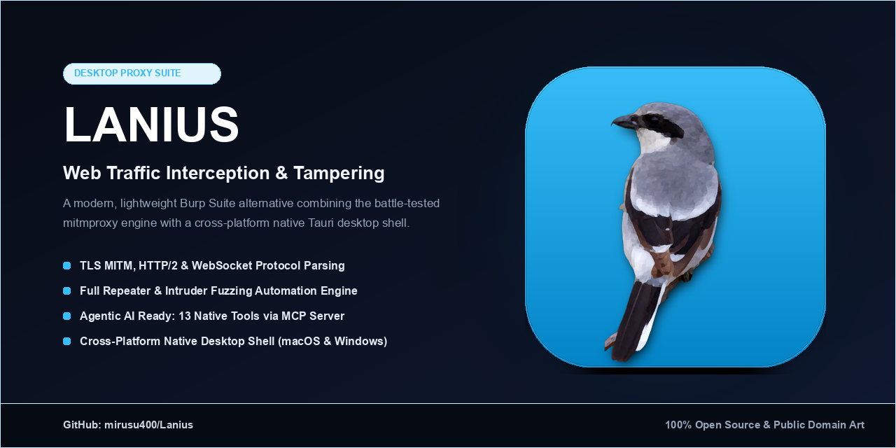
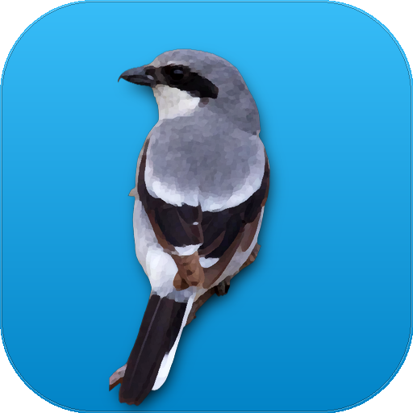
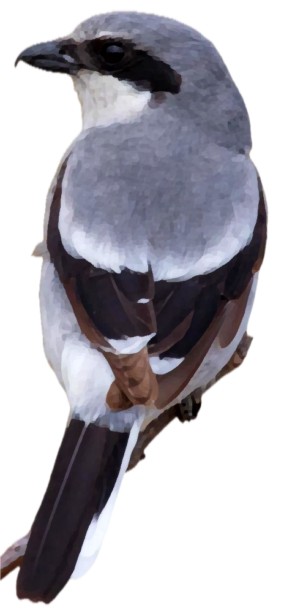

# 🦅 Lanius Brand & Icon Assets

Lanius(때까치, Butcherbird)의 트래픽 인터셉션 메타포와 퍼핀 브라우저(Puffin Browser) 스타일의 회화적 감성을 결합한 **100% 저작권 안전(Public Domain)** 공식 브랜드 에셋 세트입니다.

> **저작권 라이선스 보증 (100% Zero Copyright Liability):**
> 본 에셋은 **미국 연방 어류·야생동물 관리국(USFWS) 공식 퍼블릭 도메인(Public Domain, 17 U.S.C. § 105)** 초고해상도 Loggerhead Shrike 야생 사진을 기반으로 제작되었습니다.
> 원작자의 저작권 걱정 없이 상업적 이용, 재배포, 수정이 자유롭습니다.

---

## 🎨 1. README 히어로 배너 (Header Banner)

GitHub 저장소 `README.md` 상단에 삽입하기 위한 와이드스크린 배너입니다 (1280 × 440 px).


```markdown

```

---

## 🌐 2. 소셜 프리뷰 카드 (GitHub Social Card / OG Image)

GitHub Settings -> Social Preview 및 SNS/검색 엔진 노출을 위한 2:1 비율 카드입니다 (1280 × 640 px).



---

## 📱 3. 공식 앱 아이콘 (Official App Icon)

퍼핀 브라우저 시그니처 오션 스카이 블루 배경에 Kuwahara 디지털 회화 알고리즘을 적용한 macOS 규격 아이콘입니다 (512 × 512 px).

| 공식 앱 아이콘 | 파일 경로 | 적용 대상 |
| :---: | :--- | :--- |
|  | **`app_icon.png`** (`pd_puffin_01_sky.png`) | 데스크톱 앱(Tauri), 번들(`icon.icns`, `icon.ico`), 파비콘(`favicon.svg`) |

---

## 🪶 4. 투명 배경 마스코트 (Transparent Mascot)

UI 컴포넌트, 스플래시 화면, 문서, 굿즈 등 다양한 배경 위에 자유롭게 합성할 수 있는 누끼 투명 PNG입니다.

| 전신 고해상도 투명 마스코트 | 512×512 아바타 규격 투명 마스코트 |
| :---: | :---: |
|  |  |
| **`lanius_mascot_transparent.png`** | **`lanius_mascot_avatar.png`** |
| (고해상도 원본 비율 투명 배경) | (1:1 정사각 캔버스 중앙 정렬) |

---

## 🛠️ 앱 아이콘 적용 스크립트

```bash
# 기본 앱 아이콘 적용 (Tauri icns, ico, png, 웹 favicon 일괄 업데이트)
python3 scripts/apply_app_icon.py docs/icons/app_icon.png
```
