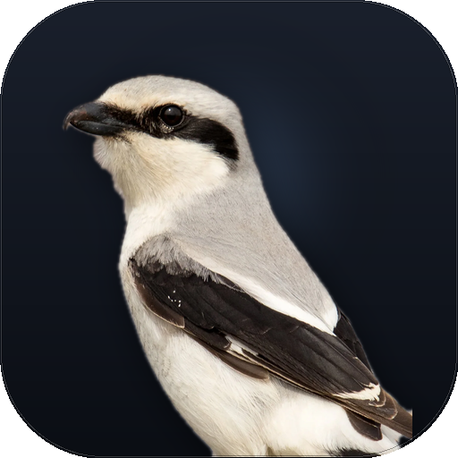
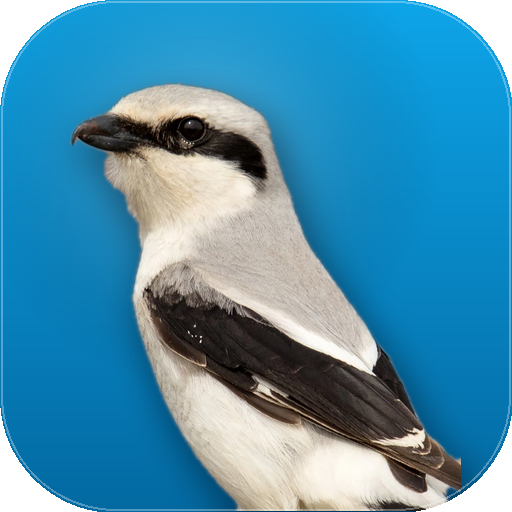
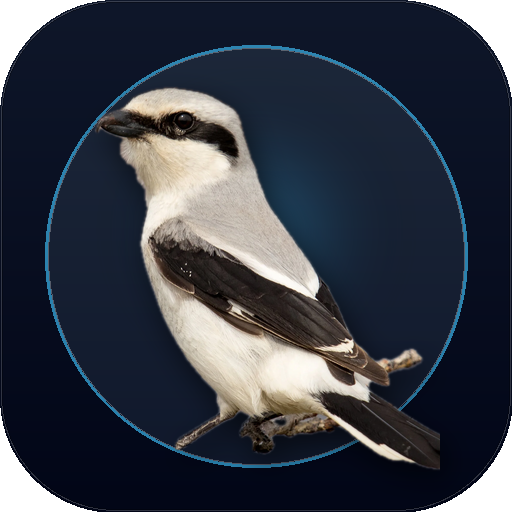
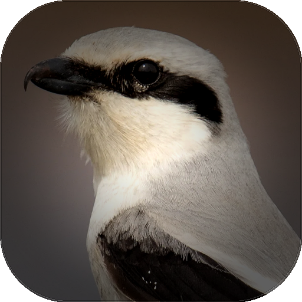
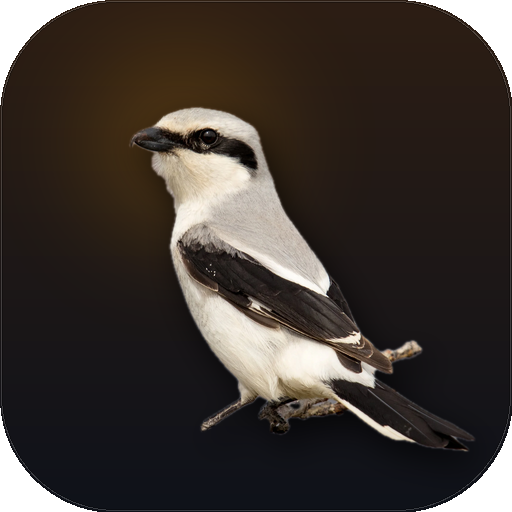
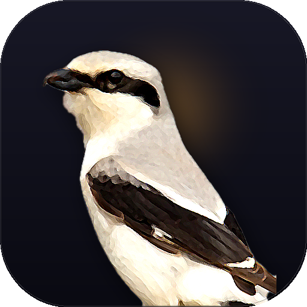

# Lanius (라니우스) 앱 아이콘 디자인 견본

이 문서는 [CODEX.MD](../../CODEX.MD)의 Lanius(때까치 / Butcher Bird) 상징성을 바탕으로 제작된 아이콘 모음입니다.

---

## 🐦 [NEW] 퍼핀 브라우저 감성의 반실사/현실적(Realistic) 시안 6종
> **디자인 원칙:**
> - 사용자가 제공한 실제 때까치(Great Grey Shrike, *Lanius excubitor*)의 고해상도 실물 사진을 기반으로 제작
> - **퍼핀 브라우저(Puffin Browser) 스타일:** 실제 새의 자연스러운 깃털 질감, 흑백 마스크, 은빛 그레이와 갈고리 부리를 살려 친근하면서도 날카로운 데스크톱 마스코트 앱 아이콘으로 완성
> - Apple macOS Big Sur/Sequoia 표준 스퀘어클(Squircle, rx=115) 및 미세 림 라이트 적용

### 1. `puffin_01_studio_portrait` (스튜디오 다크 슬레이트 포트레이트)

- **파일:** [`puffin_01_studio_portrait.png`](./puffin_01_studio_portrait.png)
- **배경:** 딥 슬레이트 네이비 스튜디오 그라데이션 + 소프트 백라이트 헤일로
- **특징:** 때까치의 상반신을 기품 있게 배치하고 머리 뒤편에 은은한 조명을 주어 도크(Dock) 위에서 묵직하고 세련된 인상을 주는 대표 시안.

---

### 2. `puffin_06_cyan_sky` (퍼핀 시그니처 오션 스카이)

- **파일:** [`puffin_06_cyan_sky.png`](./puffin_06_cyan_sky.png)
- **배경:** 퍼핀 브라우저 고유의 청명한 시안/오션 블루 (`#0EA5E9` → `#0369A1`)
- **특징:** 퍼핀 브라우저의 컬러 아이덴티티를 가장 직접적으로 오마주한 시안. 푸른 하늘 배경과 때까치의 흑백 깃털이 강렬한 대비를 이뤄 시인성이 가장 뛰어남.

---

### 3. `puffin_02_circular_badge` (서큘러 뱃지 & 팝아웃 3D)

- **파일:** [`puffin_02_circular_badge.png`](./puffin_02_circular_badge.png)
- **배경:** 스페이스 네이비 + 앰비언트 글로우가 감도는 원형 링(Ring) 뱃지
- **특징:** 원형 뱃지 밖으로 때까치의 머리와 부리가 살짝 튀어나오는(Pop-out) 입체적 3D 엠블럼 구조. 모던 브라우저 및 유틸리티 앱의 정통 스타일.

---

### 4. `puffin_03_macro_focus` (클로즈업 매크로 & 관측 렌즈)

- **파일:** [`puffin_03_macro_focus.png`](./puffin_03_macro_focus.png)
- **배경:** 오리지널 아웃포커스 보케 + 가장자리 비네팅(Vignette)
- **특징:** 때까치의 가장 결정적인 무기인 '갈고리 부리(Hooked beak with tooth)'와 '사냥꾼 눈매'에 초근접 포커스를 맞춘 매크로 아이콘. 트래픽을 정밀하게 가로채고 관측하는 도구의 성격을 극대화.

---

### 5. `puffin_04_perched_natural` (가시나무 위의 전신 실물)

- **파일:** [`puffin_04_perched_natural.png`](./puffin_04_perched_natural.png)
- **배경:** 황혼(Twilight) 웜 앰버 백라이트 + 다크 흑갈색 슬레이트
- **특징:** 원본 사진 속 가시 나뭇가지에 앉은 때까치 전신과 긴 꼬리를 그대로 살려낸 내추럴 마스코트. Lanius("가시에 먹이를 꽂는 도축자 새")의 생태적 유래를 가장 정직하게 담아냄.

---

### 6. `puffin_05_painterly_mascot` (페인터리 일러스트레이션)

- **파일:** [`puffin_05_painterly_mascot.png`](./puffin_05_painterly_mascot.png)
- **배경:** 딥 나이트 바이올렛 슬레이트 + 앰버 림 라이트
- **특징:** 실사 사진의 깃털 결을 엣지 보존 유화/페인팅 필터로 부드럽게 정돈하여, 사진보다는 정교하게 그려진 디지털 일러스트레이션 마스코트 같은 질감을 연출.

---

## 🎨 퍼핀 스타일 현실적 시안 비교 요약

| 번호 | 시안명 | 배경 스타일 | 구도 특징 | 추천 분위기 |
|:---:|:---|:---|:---|:---|
| **01** | `puffin_01_studio_portrait` | 다크 슬레이트 + 소프트 헤일로 | 상반신 포트레이트 | 클래식 프리미엄 macOS 앱 |
| **02** | `puffin_06_cyan_sky` | 퍼핀 오션 시안 블루 | 상반신 + 고대비 | 밝고 경쾌한 모던 브라우저 스타일 |
| **03** | `puffin_02_circular_badge` | 다크 링 뱃지 + 팝아웃 | 전신 뱃지 인/아웃 | 브랜드 엠블럼, 트레이/스토어 |
| **04** | `puffin_03_macro_focus` | 보케 비네팅 매크로 | 헤드 & 갈고리 부리 초근접 | 날카로운 보안/분석 도구 포커스 |
| **05** | `puffin_04_perched_natural` | 황혼 앰버 백라이트 | 가시나무 전신 | 자연스럽고 진중한 내추럴 룩 |
| **06** | `puffin_05_painterly_mascot` | 나이트 슬레이트 페인터리 | 유화풍 디지털 일러스트 | 부드럽고 친근한 마스코트 일러스트 |

---

## 📁 아카이브 (이전 시안)

이전 벡터 / 3D 시안 목록 접기/펼치기

### 모던 플랫 컬러 시안 5종
- `modern_01_cyber_shrike.png`
- `modern_02_shield_crest.png`
- `modern_03_minimal_origami.png`
- `modern_04_intercept_swift.png`
- `modern_05_masked_hunter.png`

### 흑백 단색(Pure Monochrome) 5종
- `mono_01_shrike_head.png`
- `mono_02_shrike_shield.png`
- `mono_03_diving_interceptor.png`
- `mono_04_geometric_faceted.png`
- `mono_05_shrike_perch_thorn.png`

### 초기 3D/네온 시안 5종
- `icon_shrike_beak_1789115872128.jpg`
- `icon_packet_thorn_1789115889469.jpg`
- `icon_shrike_shield_1789115909250.jpg`
- `icon_concept4_mitm.svg.png`
- `icon_concept5_monogram.svg.png`

