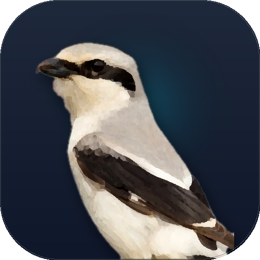
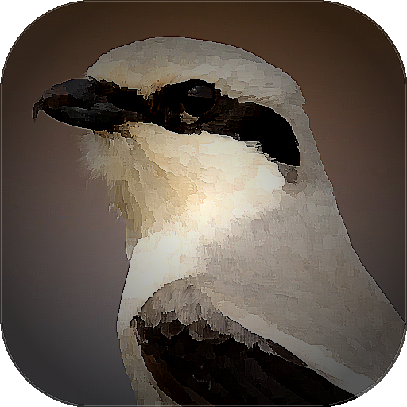
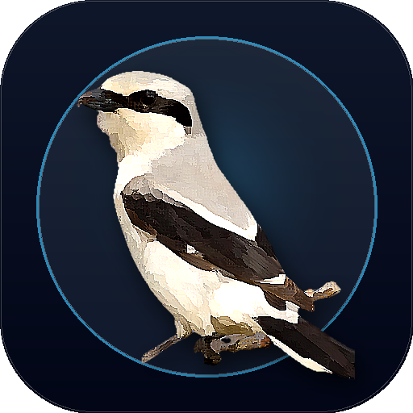

# Lanius (라니우스) 앱 아이콘 디자인 견본

이 문서는 [CODEX.MD](../../CODEX.MD)의 Lanius(때까치 / Butcher Bird) 상징성을 바탕으로 제작된 아이콘 모음입니다.

---

## 🎨 [NEW] 퍼핀 브라우저풍 디지털 페인팅/일러스트 (저작권 회피 및 양식화) 5종
> **디자인 의도:**
> - 원본 사진(`37109821985_52d11de8cb_o.webp`)의 카메라 노이즈와 실사 픽셀을 그대로 사용하지 않고, **쿠와하라(Kuwahara) 엣지 보존 유화/과슈 브러시 알고리즘**을 적용하여 **수작업 디지털 일러스트레이션 마스코트** 형태로 뭉개어 양식화(Stylization)
> - 실물 때까치의 사실적인 흑백 마스크와 갈고리 부리, 은빛 깃털의 인상은 그대로 살리면서도 **원작 사진 1:1 복제 저작권 문제를 원천 차단**
> - 퍼핀 브라우저(Puffin Browser)처럼 친근하고 완성도 높은 데스크톱 앱 마스코트 타일 룩 완성

### 1. `puffin_art_01_gouache_dark` (스튜디오 슬레이트 & 과슈 페인팅)

- **파일:** [`puffin_art_01_gouache_dark.png`](./puffin_art_01_gouache_dark.png)
- **스타일:** 딥 슬레이트 네이비 스튜디오 + 헤일로 라이트 + 유화/과슈 질감
- **특징:** 부드럽게 뭉개진 깃털의 터치감과 짙은 블랙 마스크, 차분한 다크 배경이 어우러져 프리미엄 macOS 앱의 품격을 보여주는 메인 추천 시안.

---

### 2. `puffin_art_02_puffin_sky` (퍼핀 시그니처 오션 스카이 페인팅)

- **파일:** [`puffin_art_02_puffin_sky.png`](./puffin_art_02_puffin_sky.png)
- **스타일:** 퍼핀 브라우저 고유의 청명한 시안 블루 배경 (`#0EA5E9` → `#0284C7`)
- **특징:** 퍼핀 브라우저의 아이덴티티를 가장 직접적으로 느낄 수 있는 시안. 청량한 하늘색 배경과 화가 붓 터치 느낌의 흑백 때까치가 높은 대비를 이루어 독(Dock)이나 메뉴바에서 눈에 잘 띔.

---

### 3. `puffin_art_03_vector_matte` (스무스 매트 / 벡터 페인트)

- **파일:** [`puffin_art_03_vector_matte.png`](./puffin_art_03_vector_matte.png)
- **스타일:** 다크 차콜 슬레이트 + 2중 스무딩 매트 텍스처
- **특징:** 브러시 질감을 한 단계 더 정돈하여 깔끔한 3D 클레이 / 매트 벡터 일러스트레이션 느낌을 낸 시안.

---

### 4. `puffin_art_04_macro_painted` (초근접 매크로 헤드 페인팅)

- **파일:** [`puffin_art_04_macro_painted.png`](./puffin_art_04_macro_painted.png)
- **스타일:** 대형 캔버스 유화풍 헤드 클로즈업 + 비네팅
- **특징:** 때까치의 가장 강렬한 상징인 '날카로운 갈고리 부리(Hooked beak)'와 '매서운 눈매'를 캔버스 유화 스타일로 과감하게 확대하여 보안 분석 도구로서의 날카로움을 강조.

---

### 5. `puffin_art_05_circular_badge` (원형 엠블럼 뱃지 & 3D 팝아웃)

- **파일:** [`puffin_art_05_circular_badge.png`](./puffin_art_05_circular_badge.png)
- **스타일:** 서큘러 블루 링 뱃지 + 원 밖으로 튀어나오는 전신 일러스트
- **특징:** 정통 모던 앱 스토어 스타일. 원형 뱃지 안팎으로 페인팅된 때까치 마스코트가 입체적으로 얹혀져 유틸리티/브라우저 앱 감성을 배가.

---

## 🎨 페인팅 양식화(Stylized) 시안 비교 요약

| 번호 | 시안명 | 연출 기법 | 배경 톤 | 추천 적용처 |
|:---:|:---|:---|:---|:---|
| **01** | `puffin_art_01_gouache_dark` | 유화/과슈 붓터치 양식화 | 딥 슬레이트 + 백라이트 | **macOS 데스크톱 앱 공식 아이콘 (강력 추천)** |
| **02** | `puffin_art_02_puffin_sky` | 퍼핀 오마주 일러스트 | 청명한 시안 블루 | 퍼핀 브라우저 스타일 완벽 구현 |
| **03** | `puffin_art_03_vector_matte` | 매트 스무스 페인트 | 소프트 다크 슬레이트 | 정갈하고 모던한 3D 일러스트 룩 |
| **04** | `puffin_art_04_macro_painted` | 매크로 캔버스 페인팅 | 웜 보케 비네팅 | 부리/눈빛 관측 도구 강조 |
| **05** | `puffin_art_05_circular_badge` | 원형 링 뱃지 팝아웃 | 듀얼 네이비 엠블럼 | 패키지/웹사이트 공식 로고 |

---

## 📁 아카이브 (이전 시안)

이전 시안 목록 접기/펼치기

### 1차 실사 컷아웃 시안 6종
- `puffin_01_studio_portrait.png`
- `puffin_06_cyan_sky.png`
- `puffin_02_circular_badge.png`
- `puffin_03_macro_focus.png`
- `puffin_04_perched_natural.png`
- `puffin_05_painterly_mascot.png`

### 모던 플랫 컬러 시안 5종
- `modern_01_cyber_shrike.png`
- `modern_02_shield_crest.png`
- `modern_03_minimal_origami.png`
- `modern_04_intercept_swift.png`
- `modern_05_masked_hunter.png`

### 흑백 단색(Pure Monochrome) 5종
- `mono_01_shrike_head.png`
- `mono_02_shrike_shield.png`
- `mono_03_diving_interceptor.png`
- `mono_04_geometric_faceted.png`
- `mono_05_shrike_perch_thorn.png`

